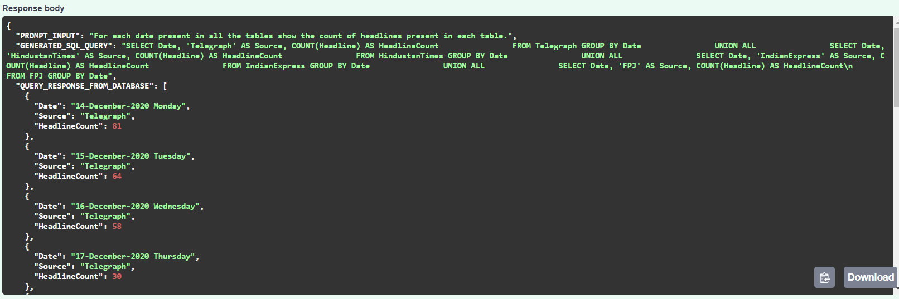

### LLM Based Text-to-SQL Generation and Execution with FastAPI

This repository contains a FastAPI-based and LLM powered Text-to-SQL application that allows users to input a natural language query as prompt, converts it to SQL, executes the SQL on a provided SQLite database, and returns the results.

#### Table of Contents
- [LLM Based Text-to-SQL Generation and Execution with FastAPI](#llm-based-text-to-sql-generation-and-execution-with-fastapi)
  - [Table of Contents](#table-of-contents)
  - [Features](#features)
  - [Installation](#installation)
    - [1. Clone the Repository](#1-clone-the-repository)
    - [2. Create a Virtual Environment](#2-create-a-virtual-environment)
    - [3. Install Dependencies](#3-install-dependencies)
  - [Provide Database File](#provide-database-file)
    - [Steps:](#steps)
  - [Running the API](#running-the-api)
  - [API Endpoints](#api-endpoints)
    - [1. **POST /query**](#1-post-query)
  - [Demo](#demo)
  - [Option to Use Choice of LLM](#option-to-use-choice-of-llm)

---

#### Features
- Convert natural language queries to SQL queries using a language model.
- Execute the generated SQL query on a database.
- Return the query results in JSON format.
- Support for SQLite databases.

---

#### Installation

##### 1. Clone the Repository

To clone the repository, run the following command in your terminal:

```bash
git clone https://github.com/your-username/your-repo-name.git
```

```bash
cd your-repo-name
```

##### 2. Create a Virtual Environment

```bash
python -m venv .venv
.venv\Scripts\activate
```

##### 3. Install Dependencies

```bash
pip install -r requirements.txt
```
---

#### Provide Database File

This API works with SQLite databases. 

##### Steps:
1. Place your SQLite database file (with `.db` or `.sqlite` extension) in the `databases` folder at the root of the project.
   
   Example:
   ```
   ├── databases
   │   └── your_database.db
   ```

2. The API will automatically detect and connect to the `.db` or `.sqlite` file in the `databases` folder.

---

#### Running the API

Once the dependencies are installed and the database file is in place, you can run the FastAPI server.

Run the following command from the project's root directory to start the API:

```bash
python app/main.py
```

This will start the API at `http://127.0.0.1:8000`.

Open the API page at `http://127.0.0.1:8000/docs`.

**NOTE: The first ever run of the API takes some time as the language model is downloaded to cache from the source repository.**
**Refer to the [Option to Use Choice of LLM](#option-to-use-choice-of-llm) section for more details.**

---

#### API Endpoints

##### 1. **POST /query**
   - **Description**: Converts a text-based query to SQL and returns the results.
   - **Request Body**:
     ```json
     {
       "text": "your natural language query here"
     }
     ```
   - **Response**:
     ```json
     {
       "PROMPT_INPUT": "natural language query prompt",
       "GENERATED_SQL_QUERY": "SELECT * FROM table WHERE ...",
       "QUERY_RESPONSE_FROM_DATABASE": [
         {
           "column1": "value1",
           "column2": "value2"
         }
       ]
     }
     ```

---

#### Demo

Here are some screenshots demonstrating the prompt and response of the Text-to-SQL API:

1. **Example 1**:
   

2. **Example 2**:
   

3. **Example 3**:
   

---

#### Option to Use Choice of LLM

The choice of LLM to use at the core for SQL generation can be made inside the `app/models/llm.py` file.
According to the selected model's expected input prompt format, modify the input prompt template inside
`app/prompts/prompt_templates.py`.
```
├── app
│   ├── models
│   │   └── llm.py
│   └── prompts
│   │   └── prompt_templates.py
```
## License

This project is licensed under the MIT License - see the [LICENSE](LICENSE) file for details.
```